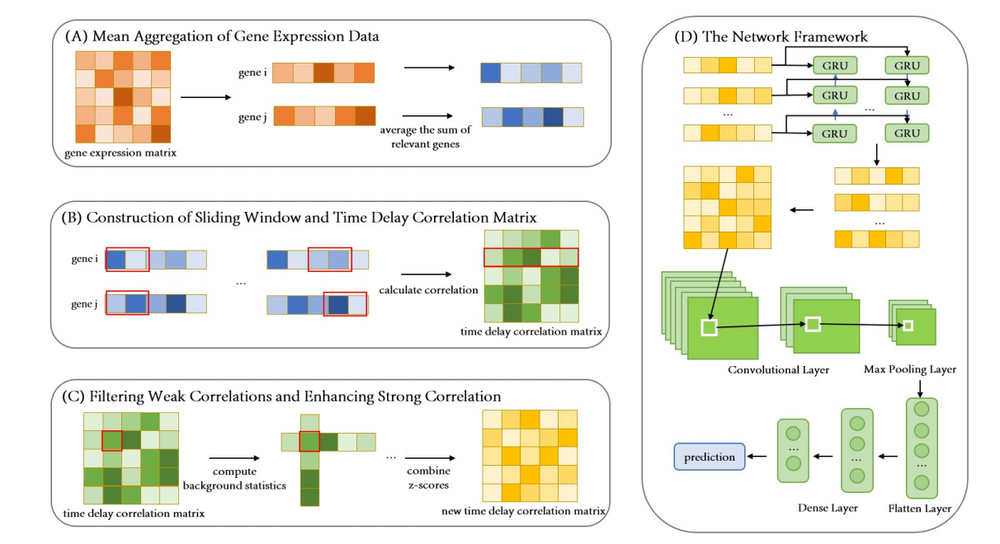

##DeepCE

## About
This directory contains the code and resources of the following paper:
"DeepCE: a deep learning framework for correlation-enhanced gene regulatory network inference in single-cell RNA sequencing data"

## Overview of the Model
The propose a deep learning framework DeepCE is illustrated in Figure 1. The framework comprises two main components: data processing and model construction. This design enables the model to jointly capture temporal dynamics and spatial patterns from the refined correlation matrices, facilitating accurate prediction of regulatory interactions.

 

## Dependencies 
- python 3.7
- scanpy                        1.9.4
- numpy                         1.24.0
- pandas                        2.1.0
- scikit-learn                  1.3.0
- tensorflow-estimator          2.10.0
- tensorflow-gpu                2.10.0
- tensorflow-intel              2.14.0
- tensorflow-io-gcs-filesystem  0.26.0
- keras                         2.10.0

All dependencies can be installed within a few minutes.

##  Usage
DeepCE take data as input file in tsv, csv, 10X format, or h5ad format provided by Scanpy (genes in columns and cells in rows for tsv and csv).

Run the following six files in sequence:
dataPreprocess_1.py, genepairlist_2.py, matrix_3.py, datasetSplit_4.py, train_5.py, predict_6.py

# Data
The data can be obtained from the link below.
- BEELINE   https://github.com/Murali-group/Beeline
